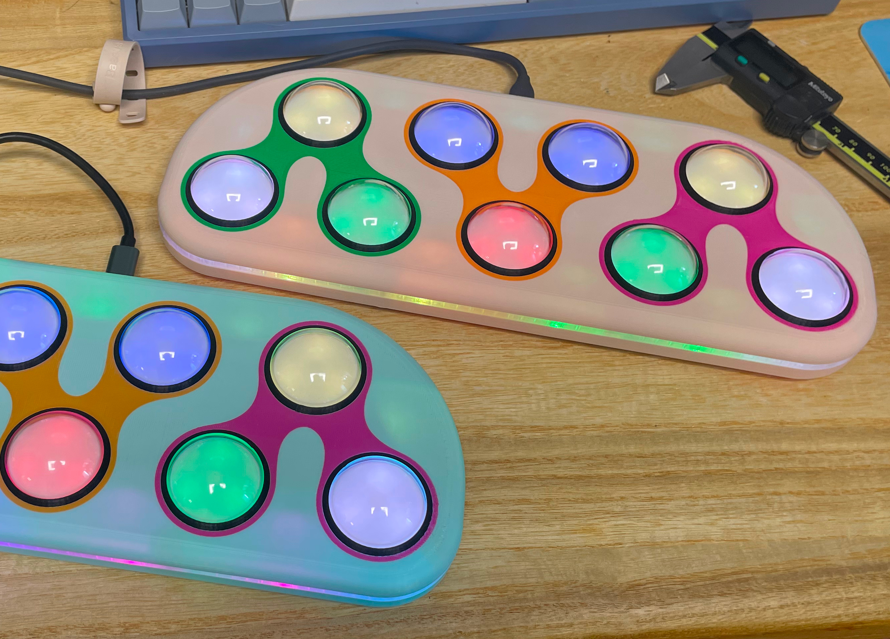
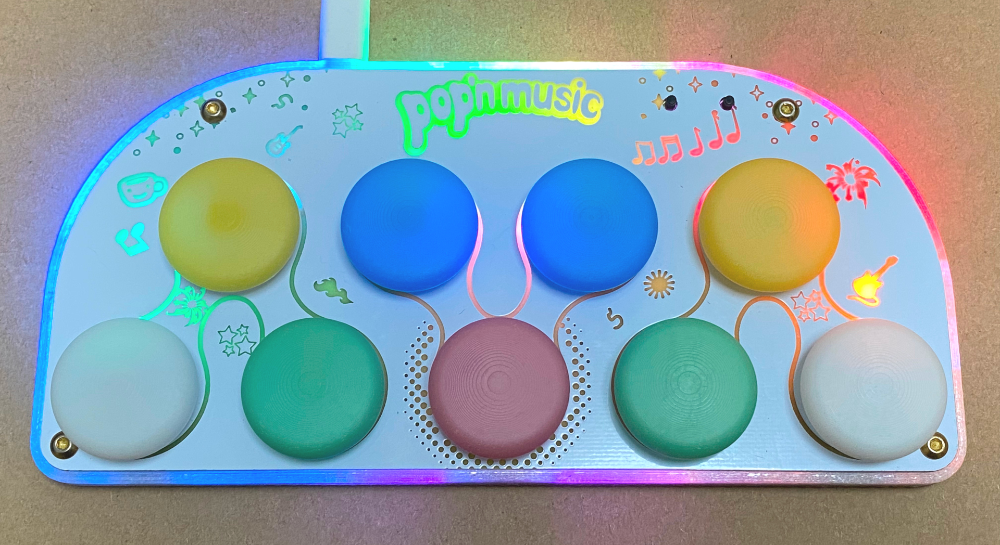
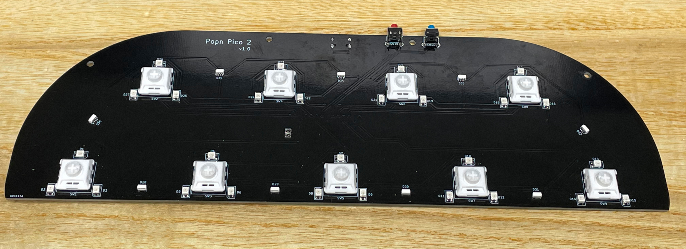
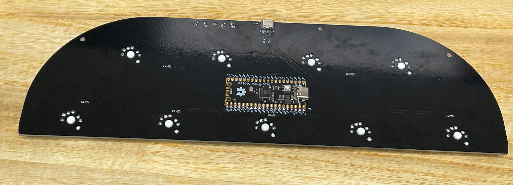
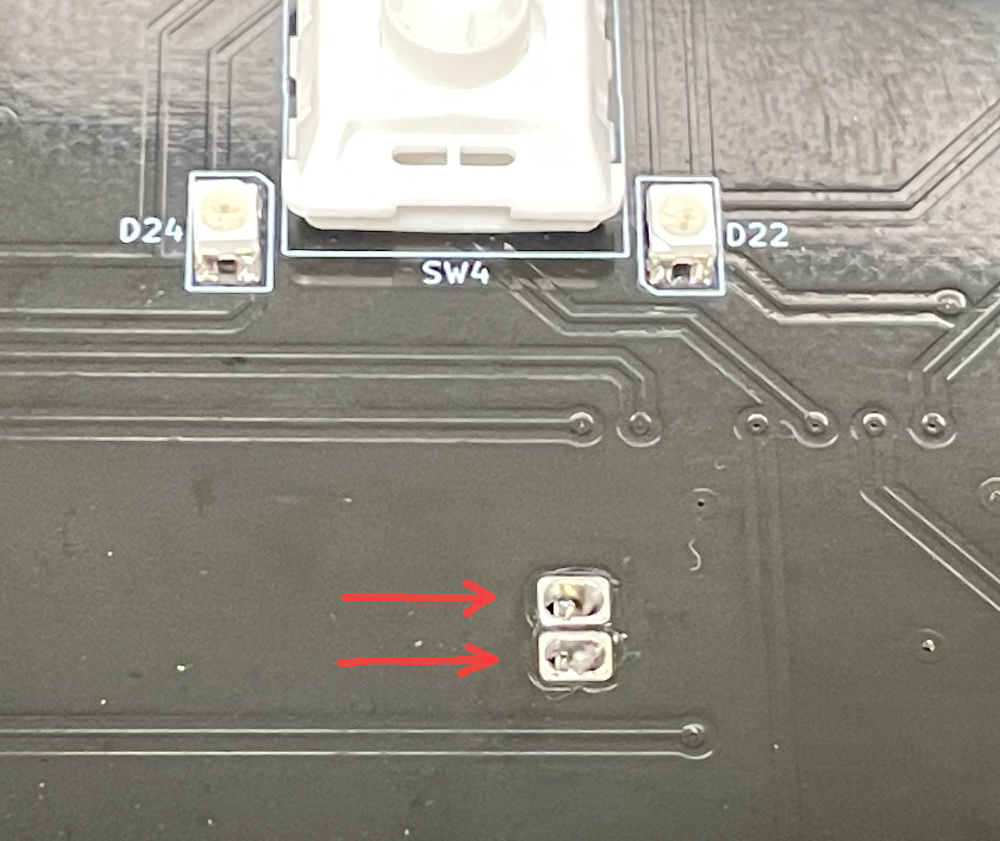
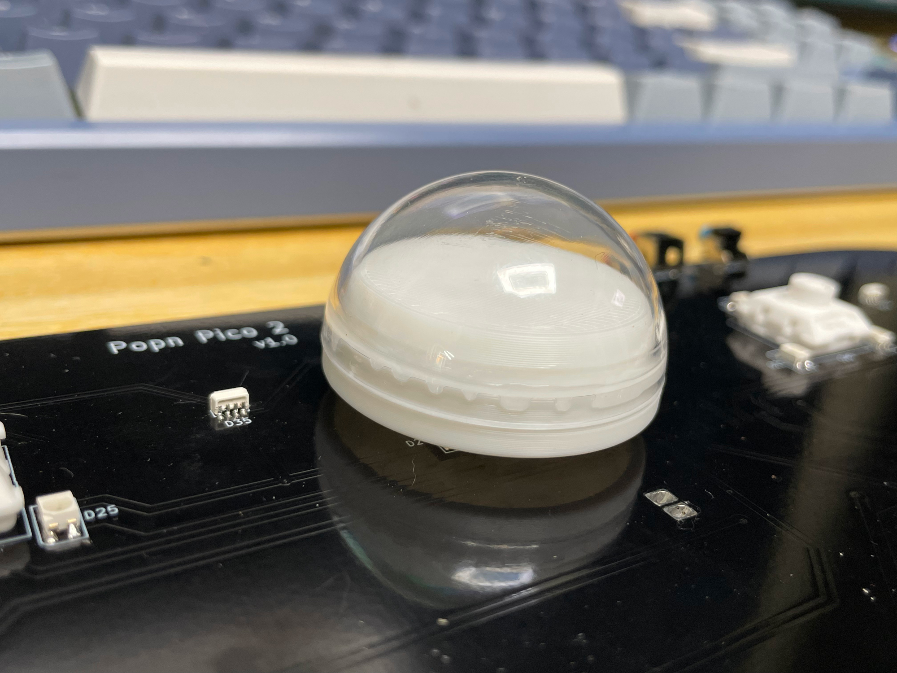

# Popn Pico - Pop'n Music Style Mini Controller
[点这里可以切换到中文版](README_CN.md)

I've made two generations of Popn Pico. The latest is Popn Pico 2. It's larger than the first generation.

The document here is for the latest generation. The files for the first generation are archived in `Gen1Archive` folder. This is what the first generation looks like.  

Features:
* It uses self-made 40mm dome buttons.
* Full HID light support.
* Command line for configurations.
* All source files open.

Thanks to many respectful guys/companies who made their tools or materials free or open source (KiCad, OnShape, InkScape, Raspberry things).

Special thanks to community projects and developers.
And also these projects:
* RP_Silicon_KiCad: https://github.com/HeadBoffin/RP_Silicon_KiCad
* Type-C: https://github.com/ai03-2725/Type-C.pretty

## About the License
It's CC-NC. So DIY for yourself and for your friend for free, don't make money from it. And plagiarism that doesn’t even dare to mention the original author is not acceptable. Plase note that pooling orders and group buying for raw materials is acceptable. Selling off any leftover components without profit is also acceptable.

If you're interested in buying from me or some kind of commercial use, please contact me (Discord, QQ group, Wechat group or leave your contact in issue section).

## My Discord Invitation
https://discord.gg/M8f2PPQFEA

## My Other Projects
You can check out my other cool projects.

            

* Popn Pico: https://github.com/whowechina/popn_pico
* IIDX Pico: https://github.com/whowechina/iidx_pico
* IIDX Teeny: https://github.com/whowechina/iidx_teeny
* Chu Pico: https://github.com/whowechina/chu_pico
* Mai Pico: https://github.com/whowechina/mai_pico
* Diva Pico: https://github.com/whowechina/diva_pico
* AIC Pico: https://github.com/whowechina/aic_pico
* Groove Pico: https://github.com/whowechina/groove_pico
* Geki Pico: https://github.com/whowechina/geki_pico
* Musec Pico: https://github.com/whowechina/musec_pico
* Ju Pico: https://github.com/whowechina/ju_pico
* Bishi Pico: https://github.com/whowechina/bishi_pico

## **Disclaimer** ##
I made this project in my personal time without any sponsorship. I will continue to improve the project. I have done my best to ensure that everything is accurate and functional, there's always a chance that mistakes may occur. I cannot be held responsible for any loss of your time or money that may result from using this open source project. Thank you for your understanding.

## HOW TO BUILD
### PCB and Components
* Go JLCPCB or any PCB vendor you like, make order with the gerber zip files (latest `Production\PCB\popn_pico2_xxx.zip`), regular FR-4 board, black color, **1.6mm** thickness.
* 1x Rasberry Pico Pi Pico or pin-to-pin compatible clones.  
  https://www.raspberrypi.com/products/raspberry-pi-pico
* 1x USB Type-C socket (918-418K2023S40001 or KH-TYPE-C-16P)
* 27x WS2812B-3528 RGB LEDs.
* 9x WS2812B-4020 RGB LEDs (side facing).
* 6x 0603 0.1uF (0.1~1uF all fine) capacitors.
* 2x 0603 5.1kohm resistors.
* 9x Kailh Choc v2 switches, linear 35-50gf ones are recommended. I personally use Kailh White Rain switches.
* 2x ALPS SKHHLWA010 6\*6\*7mm or compatible tactile switches.  
  https://tech.alpsalpine.com/e/products/detail/SKHHLWA010/

* This is how it looks after soldering.  
    
  

* Becareful of 2 pin holes. It's a common oversight to either forget to solder them or to leave air bubbles during the process. To avoid this, solder slowly from one side of the hole, using minimal solder wire and a generous amount of flux.  
  

### Test the PCB
* You can test the PCB now, put the firmware in.
* LEDs should light up and respond to the button presses.
* Popn Pico should be recognized as a USB HID device, here's the test page.  
  https://greggman.github.io/html5-gamepad-test/

### 3D Printing
#### Printing parameters  
* PLA or PETG.
* Layer height: 0.2mm
* Wall: >= 3.
* Support: Yes, always, but only on bed and no need for bridges.
* Glue on bed: Yes, it prevents corner warping.
* Files are always in milimeter unit, not inch.

#### Housing Parts
* Base: `Production\3DPrint\popn_pico2_base.stl`. Color is up to you. Support will help the screw holes.
* Middle Support: `Production\3DPrint\popn_pico2_support.stl`, clear transparent.
* Panel: `Production\3DPrint\popn_pico2_panel.3mf`. A multi-color system is highly recommended, so you can choose your favorate colors for each sub-component.

#### 9x Button Seats
* Button Seat: `Production\3DPrint\popn_pico2_button_seat.stl`, white, print upside down.

### Assembly
#### Other components needed
* 9x Chirstmas tree clear plastic balls, 40mm diameter. They come in 2 half-balls, we only need the shorter one.  
  https://www.amazon.com/Plastic-Fillable-Ornaments-Acrylic-Christmas/dp/B09ZTSGL28/
* 8x **M3\*12mm screws** for fixing the housing parts together.
* 8x silicone anti-slip pads (12mm diameter) for the bottom.
* Clear soft/flexible glue or UV curing glue. WARNING: Avoid using any cyanoacrylate-based glue, such as 502. Any glue with a similar smell should also be avoided, as they will leave white smoke marks on the acrylic.

#### Steps
1. We'll make 9 dome button caps first. Just glue the shorter half of the clear plastic ball onto the button seat use the glue mentioned earlier.  
   
2. Install 9 dome button caps onto the switches.
5. Put the PCB into the base part, and then put on the middle frame, and lastly put on the panel. Tighten them using M3 screws. Put anti-slip pads on the bottom, right on top of the screws.

#### Caution
* Each 3D printer and filament has its own tolerance. If you find the stem holes on the button are too tight, use some needle or knife to enlarge them a little bit.
* Screws are easy to break the 3D printed parts. So don't screw them too fast or too tight. When you notice the resistance suddenly increases, stop screwing.

### Firmware
* UF2 file is in `Production\Firmware` folder.
* For the new build, hold the BOOTSEL button while connect the USB to a PC, there will be a disk named "RPI-RP2" showed up. Drag the UF2 firmware binary file into it. That's it. There's a small hole at the bottom side of the Popn Pico 2, it is facing right to the BOOTSEL button.
* If it's already running Popn Pico 2 firmware, you can either use "update" in command line or hold down more than 4 buttons while connecting to USB to enter update mode.
* To access the command line, you can use this Web Serial Terminal to connect to the command line port of the controller. (Note: "?" is for help)  
  https://googlechromelabs.github.io/serial-terminal/

### Usage
* It's very simple. Just plug and play.

## CAD Source File
I'm using OnShape free subscription. It's powerful but it can't archive original designs to local, so I can only share the link here. STL/DXF/DWG files are exported from this online document.  
  https://cad.onshape.com/documents/fcfa3f71e200593febd1451f/w/3452f2d9fccae7d99b53d89a/e/55b4cd1b258679099c74739b
