# Pico Popn - Pop'n Music Controller

Features:
* It's tiny.
* 1000Hz polling rate.
* HID lights (9 button lights and Logo RGB).
* RGB rainbow effects.
* So far, it only supports Gamepad mode.

<video src="https://user-images.githubusercontent.com/11623830/189601050-35440f27-5d67-4410-8533-f4e92887f753.mp4" controls="controls" width="50%">
</video>

<video src="https://user-images.githubusercontent.com/11623830/189601062-6984f811-3431-485f-bb1b-faf98aed2351.mp4" controls="controls" width="50%">
</video>

Thanks to:
* SpeedyPotato, for his great SDVX pico project which inspired me in the first place. I also got many materials from his repo. Check out his great projects: https://github.com/speedypotato.
* CrazyRedMachine, I got panel arts from his SVG files: https://github.com/CrazyRedMachine/PopnPanel.
* Many respectful guys/companies who made their tools or materials free or open source (KiCad, OpenSCAD, InkScape, Raspberry things).

## HOW TO BUILD

### Step 1 - Buy
* Place order at jlcpcb.com for PCB and plate. Gerber zip files are **/PRODUCTION/PCB.zip** and **/PRODUCTION/PLATE.zip**. Leave everything default in JLC's ordering page (board thickness is 1.6mm). Choose what ever color you like, I prefer white.  
  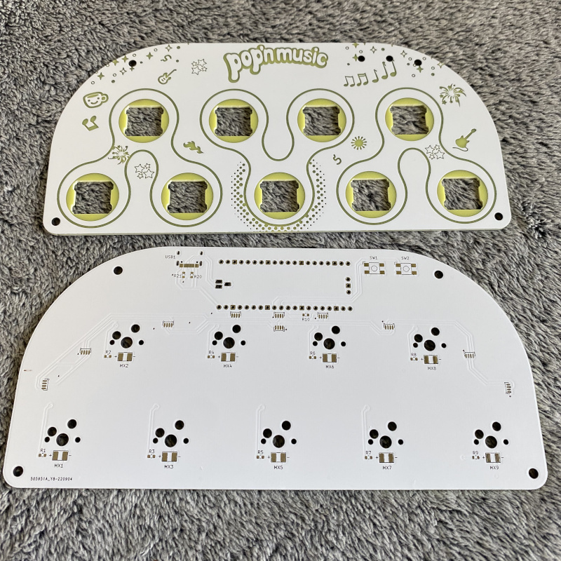

* Order 3D printing service for the case, FDM with transparent PETG filament or SLA with half-transparent resin. If you own a 3D printer, do it yourself. The file is **/PRODUCTION/pico_popn_case.stl**.  
  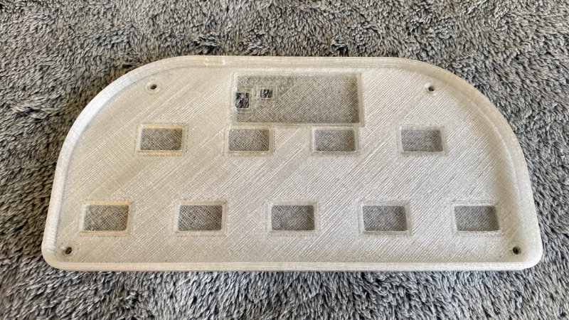

* Buy other components (get few more for tolerance):
  * 1 * Raspberry Pi Pico (https://www.raspberrypi.com/products/raspberry-pi-pico/)
  * 9 * Gateron Hotswap Sockets (https://www.gateron.co/products/gateron-hot-swap-pcb-socket)
  * 9 * Gateron 3.4mm-travel switches (I prefer Box CJ Switch, https://www.keychron.com/products/gateron-box-cj-switch)
  * 1 * USB Type-C socket (918-418K2023S40001 or KH-TYPE-C-16P)
  * 10 * WS2812B-4020 side-facing RGB LEDs
  * 9 * 2835 white LEDs (0.2W or 0.5W)
  * 10 * 0603 220ohm resistors
  * 2 * 0603 5.1kohm resistors
  * 2 * Tactile Switches (4.5x4.5x6.5mm or 4.5x4.5x7mm or KAN4542-0701C)
  * 4 * set of M3 screws/nuts/spacers (I'll explain later)
  * 9 * Keycaps (many choices I'll explain later)

### Step 2 - Solder
* Use the smallest soldering iron tip you have.
* Use solder flux, always keep the pins "wet".
* Soldering iron temperature set to around 300°C.
* Use tweezers to hold components.
* Tricks for Type-C socket and 4020 RGB LEDs.
  * Put flux on all those small pins. Melt a tiny little bit solder (seriously very very little bit) at the iron tip. Then quickly solder the pins. Flux and very little bit solder is the key.
* 2 resistors near USB socket are 5.1k ohm, others are all 220ohm.
* Don't forget to solder 3 "holes" which connects to the Raspberry Pi Pico's USB pins.  
  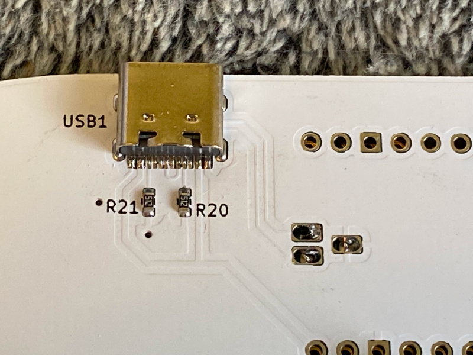
* 4020 RGB LEDs are side-facing, don't make it "up-facing".  
  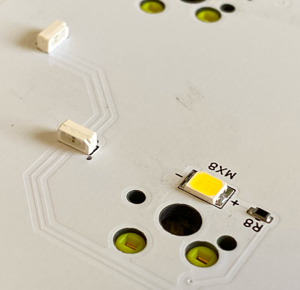
* They look like this when finish:  
  
  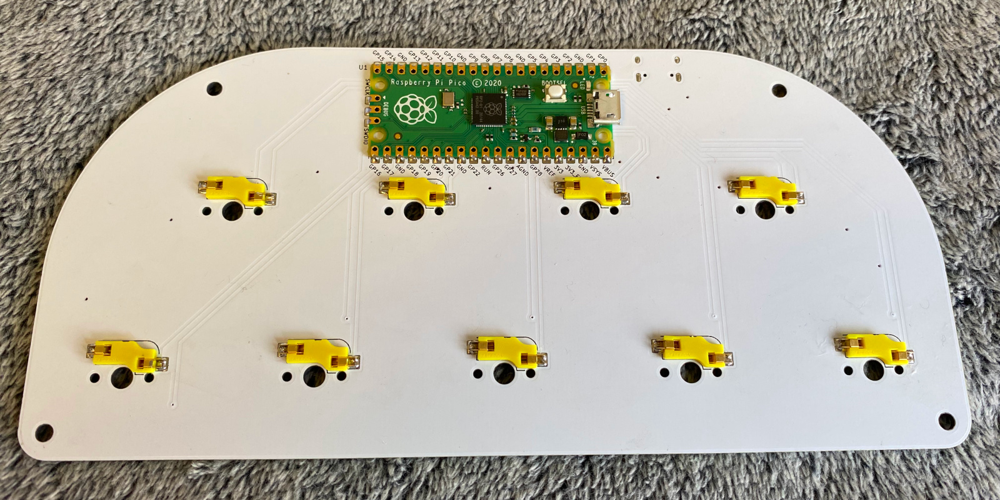

### Step 3 - Firmware
* Use a USB cable to connect the PCB to a PC/Mac computer while pressing down the small button on Raspberry Pi Pico. An explorer window will pop up. If it doesn't show up, navigate to a disk labeled "RPI-RP2".  
  
* Drag the UF2 file (**/PRODUCTION/pico_popn.uf2**) to the root of this new disk.
* The RGB lights will start rainbow effects.
* If it's not working, go back to Step 2 and fix it.

### Step 4 - Assembly
* Insert 9 key switches into the plate, be careful, don't bend the leads.  
  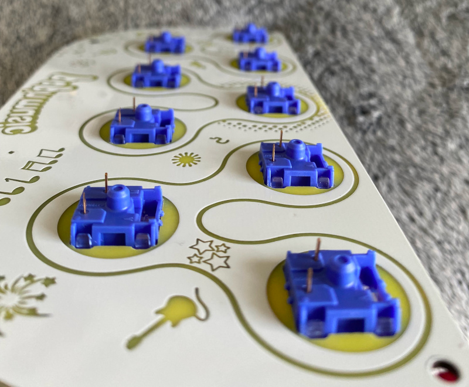
* Put the PCB into the case.
* Gap between the plate and the PCB is about 3.4mm. There're many ways to fix and fasten boards and case. Here's my solution, I reprocessed the screws and spacers as they didn't come with proper length.  
  
  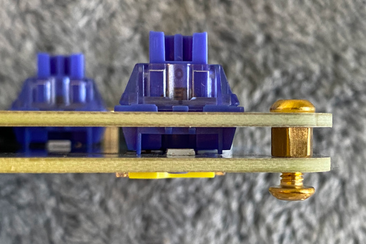
* Another way is to use a long M3 screw from top side and a nut at the bottom side. Between PCB and plate, use a 3.5mm length M3 spacer with no threads. You can also 3D print some spacers using provided **/PRODUCTION/screw_spacer.stl**. 
* Don't forget get some anti-slip silicone pads.  
  
* Almost done.  
  
  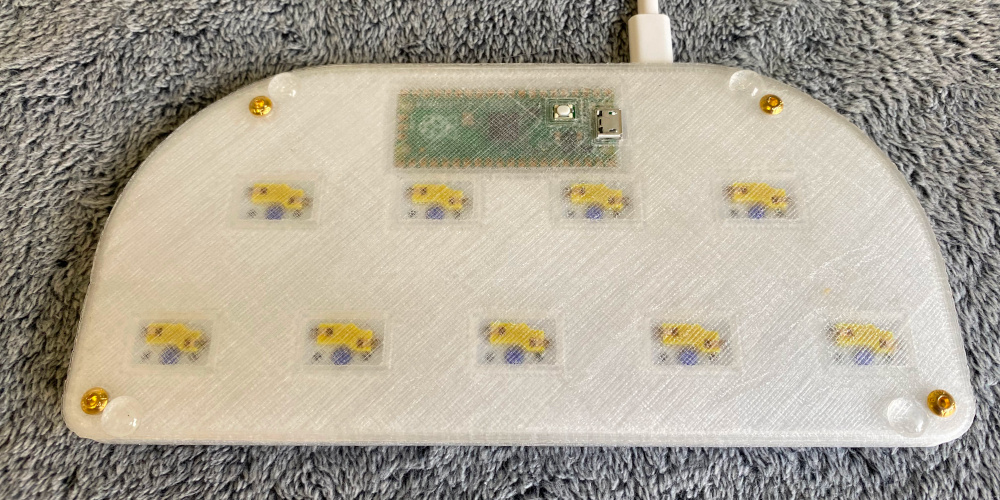

 ### Step 5 - Keycaps
 * If you have resin printer, you can make them by yourself.
   * Make half-transparent resin by mixing translucent and white resin (2:1) as the base resin.
   * Mix some drops of UV resin pigment, you can make all Pop'n Music button colors.  
     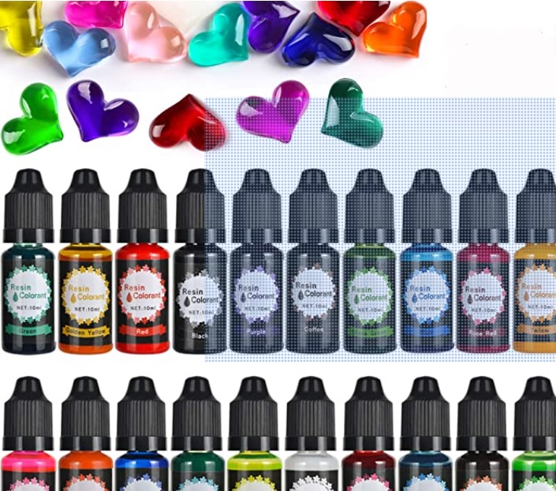
   * 3D file is **/PRODUCTION/popn_keycap.stl** or if you're using Chitubox - **/PRODUCTION/popn_keycaps.chitubox**. Orientation and support should be like this to get perfect button surface.  
    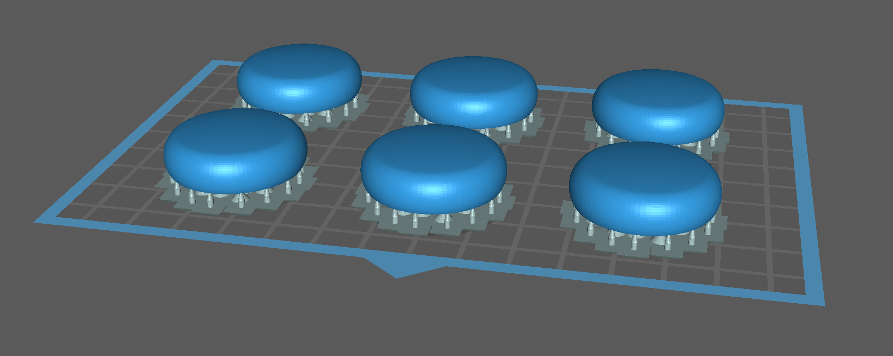
   * These are printed by my Elegoo Mars 3 Pro.  
     
* There're many other choices.
  * Homemade bottle cover keycaps  
    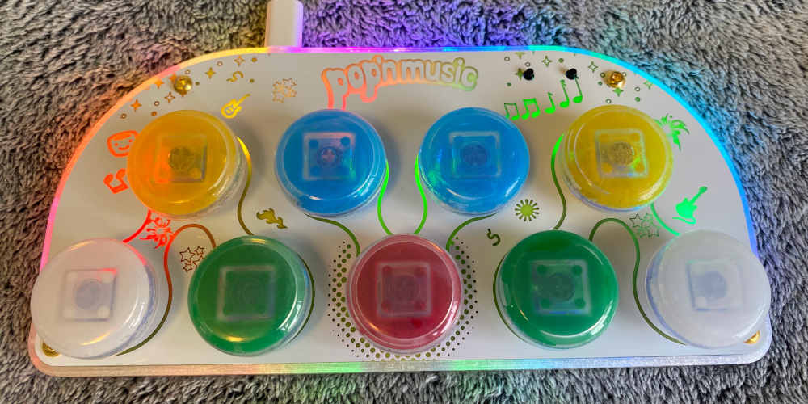
  * Homemade coat buttons keycaps  
    
  * DSA color keycaps  
    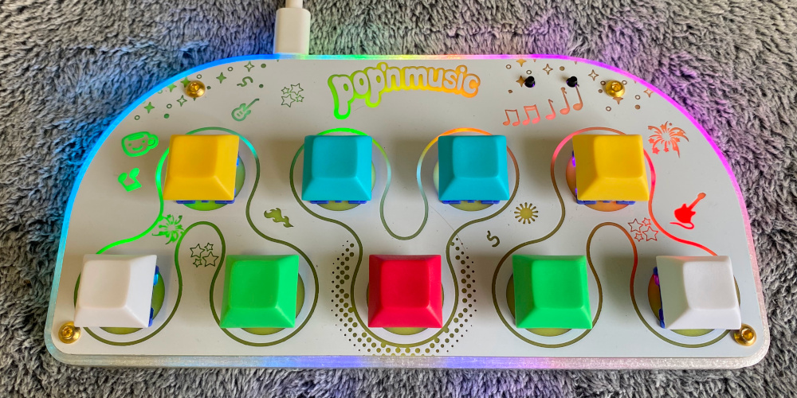
  * DSA transparent keycaps  
    
  * MA color keycaps  
    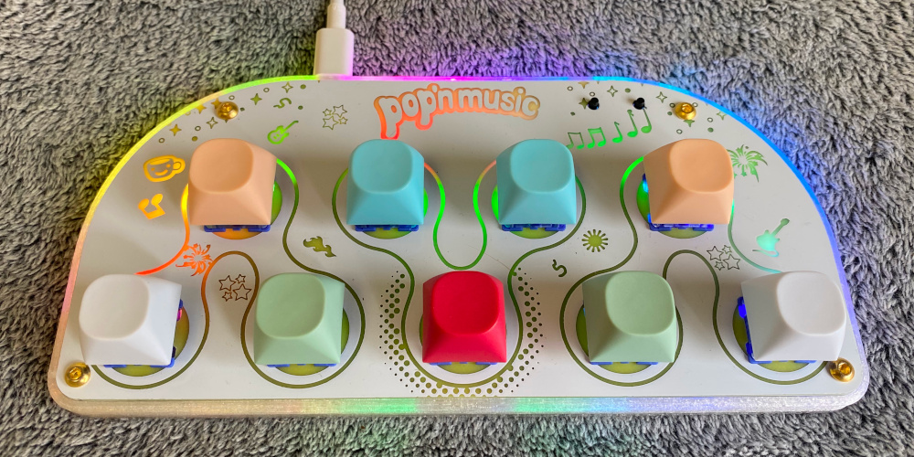
  * XDA 1.5U color keycaps  
    
  * About the homemade process.
  * I bought these inexpensive 3gram/5gram distribution bottles just to get the covers (28-30mm diameter).  
    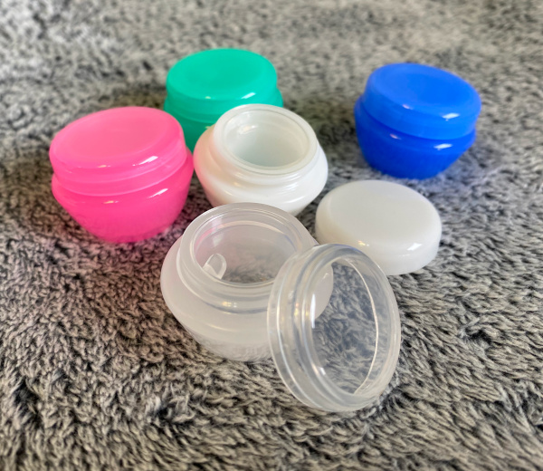
  * Cut the shaft/socket out of regular transparent keycaps.  
    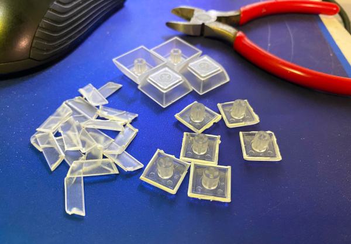
  * Drill some holes on them so later we can apply UV resin better.  
    
  * Apply UV resin, glue the socket and the cover together.  
    
    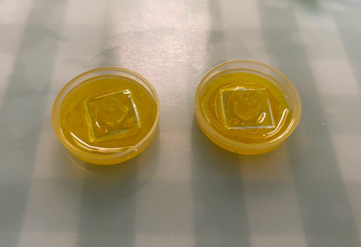
  * Don't forget alignment.  
    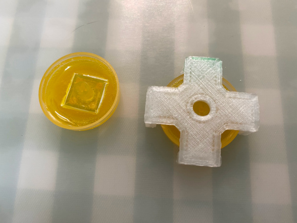
  * After cured by UV light, they look like this:  
      
